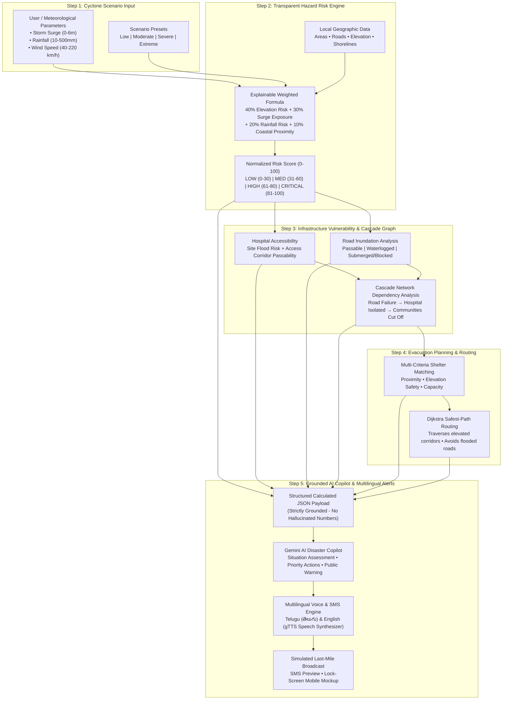

# CYCLONE-SHIELD AI
### AI-Powered Cyclone Impact, Infrastructure Vulnerability & Safe Evacuation Planner

**Study Jurisdiction:** Visakhapatnam Metropolitan Region, Andhra Pradesh, India  
**System Pipeline:** Cyclone Scenario → Hazard/Risk Analysis → Infrastructure Vulnerability → Cascade Impact → Safe Shelter Recommendation → Grounded AI Copilot Advisory → Multilingual Voice/SMS Alert

---

## 1. Problem Statement

Tropical cyclones in the Bay of Bengal regularly threaten coastal metropolises such as Visakhapatnam. Traditional cyclone alert services forecast meteorological parameters (e.g., track, central pressure, estimated wind speed, aggregate rainfall). However, municipal commissioners, disaster management authorities (APSDMA/NDRF), and emergency dispatchers are left answering the operational ground questions:

> **“If a cyclone affects this area, what will be impacted, which critical infrastructure may become inaccessible, where should people evacuate, and what warning should be sent to them?”**

Current systems often suffer from:
1. **Disconnected Hazard Modeling:** Weather forecasts do not directly map to localized road cut-offs and hospital isolations.
2. **Hidden Domino/Cascade Effects:** A flooded coastal road doesn't just halt traffic—it severs access to trauma centers, stranding thousands of vulnerable citizens.
3. **Information Overload during Crisis:** Evacuation warnings are often non-actionable or generic, rather than providing exact safe corridors and clear roads to avoid in citizens' native languages.

---

## 2. Solution: CYCLONE-SHIELD AI

**CYCLONE-SHIELD AI** is an end-to-end disaster decision-support prototype that couples an explainable multi-factor hazard risk engine with network graph dependency modeling and grounded generative AI reasoning.

Rather than predicting the weather from scratch, the system transforms cyclone scenarios into tactical decisions:
- **Quantifies Localized Risk:** Generates transparent 0–100 risk indices down to community settlements.
- **Audits Healthcare & Road Infrastructure:** Evaluates facility site inundation alongside approaching corridor passability.
- **Uncovers Cascade Chain Failures:** Detects how road failures isolate critical hospitals and communities.
- **Computes Flood-Resilient Safe Corridors:** Recommends optimal cyclone shelters and Dijkstra safe navigation paths avoiding submerged corridors.
- **Grounded AI Disaster Copilot:** Leverages Gemini AI to generate time-stamped tactical briefings and public warnings grounded strictly in calculated evidence.
- **Simulates Last-Mile Alerts:** Generates actionable SMS, Text-to-Speech voice broadcasts, and smartphone lock-screen alerts in **Telugu** and **English**.

---

## 3. System Architecture & Workflow



---

## 4. Key Features

### 🧮 1. Transparent & Explainable Risk Engine
- Implements the 4-component weighted model:
  $$\text{Flood Risk Score} = 0.40 \times \text{Elevation Risk} + 0.30 \times \text{Surge Exposure} + 0.20 \times \text{Rainfall Risk} + 0.10 \times \text{Coastal Proximity}$$
- Every score is 100% explainable in the UI, displaying the exact contribution of elevation buffer, tidal surge run-up, rainfall drainage, and coastline distance.

### 🗺️ 2. Geospatial Interactive Map (Visakhapatnam)
- Built with Folium and Leaflet, centered on the Visakhapatnam coast (`17.725° N, 83.315° E`).
- Real-time visualization of:
  - **Community Hazard Bubbles:** Color-coded green (Low), yellow (Medium), orange (High), red (Critical).
  - **Road Networks:** Passable (green), waterlogged (amber dashed), submerged/blocked (thick red dashed).
  - **Hospitals & Cyclone Shelters:** Interactive popups with capacity, bed counts, and operational status.
  - **Active Safe Evacuation Corridors:** Dynamic route overlay.

### ⚡ 3. Unique Feature: Cascade Impact Analysis
- Utilizes NetworkX directed dependency graphs to detect chain-reaction failures.
- **Demonstrated Cascade Event:**
  $$\text{Beach Road (Road A) Flooded} \longrightarrow \text{KGH Hospital Corridor Severed} \longrightarrow \text{58,700 Residents in RK Beach \& Old Town Stranded} \longrightarrow \text{Ambulance Reroute Required}$$
- Outputs actionable tactical directives for the National Disaster Response Force (NDRF) and police traffic controllers.

### 🛡️ 4. Safe Shelter Recommendation & Safe-Route Routing
- Evaluates designated shelters across Visakhapatnam (e.g., MVP AU Campus Shelter, Rushikonda Hilltop, Simhachalam Sanctuary).
- Matches vulnerable areas with the closest safe shelter, ensuring that high-ground sanctuaries are reachable via clear roads.
- Implements Dijkstra safest-path routing to display recommended navigation corridors while explicitly enumerating hazardous roads to avoid.

### 🤖 5. Grounded Gemini AI Disaster Copilot
- Translates calculated hazard matrices into structured JSON briefings.
- **Strict Evidence Grounding:** Gemini is never prompted to guess or hallucinate statistics. Risk numbers, population metrics, blocked roads, and shelter names are computed first and supplied as immutable ground truth.
- **Offline Fallback Demo Mode:** If the Gemini API key is omitted or the network is offline, the system automatically uses the deterministic local grounded advisor.

### 📱 6. Multilingual Emergency Alerts & Smartphone Lockscreen Simulation
- Generates action-oriented emergency SMS in **Telugu (తెలుగు)** and **English** (with Hindi and Tamil readiness).
- **Text-to-Speech (TTS) Voice Synthesis:** Play audio voice alerts directly in the dashboard using native pronunciations.
- **Realistic Mobile Lock-Screen Mockup:** Visual simulation of high-priority cell broadcast warnings (Channel 4370) alerting citizens to evacuate immediately.

---

## 5. Technology Stack

| Layer | Technologies |
| :--- | :--- |
| **Frontend & UI** | Streamlit, Custom Responsive CSS, Smartphone Mockup Widgets |
| **Mapping & Geospatial** | Folium, Streamlit-Folium, Branca, GeoJSON |
| **Network & Graph Modeling** | NetworkX (Dependency graphs, Dijkstra shortest-safest paths) |
| **Data Processing** | Pandas, NumPy |
| **AI Copilot** | Google Gemini API (`gemini-1.5-flash`), Structured JSON output |
| **Voice / Speech Synthesis** | gTTS (Google Text-to-Speech) |
| **Data Layer** | Local sample datasets for Visakhapatnam (replaceable with GEE / OSM) |

---

## 6. Project Structure

```
cyclone-shield-ai/
├── app.py                     # Main Streamlit Dashboard Application
├── requirements.txt           # Python package dependencies
├── README.md                  # Comprehensive technical documentation & guide
├── .env.example               # Environment variables template
├── .gitignore                 # Git ignore rules
│
├── data/                      # Local geospatial datasets (Visakhapatnam)
│   ├── areas.csv              # Community settlements, population, elevation, coast distance
│   ├── hospitals.csv          # Healthcare facilities, bed capacity, access corridors
│   ├── shelters.csv           # Multi-purpose cyclone shelters, safety features
│   ├── roads.geojson          # Major coastal arterials and highway bypasses
│   └── elevation.csv          # High-resolution digital elevation sampling grid
│
├── src/                       # Core modular engines
│   ├── risk_engine.py         # 4-factor transparent flood/hazard risk calculator
│   ├── infrastructure.py      # Hospital, road, and shelter vulnerability assessor
│   ├── cascade.py             # NetworkX cascade failure & dependency engine
│   ├── evacuation.py          # Shelter matching & Dijkstra safest-path router
│   ├── gemini_advisor.py      # Grounded Gemini copilot + resilient fallback advisor
│   ├── alerts.py              # Multilingual SMS, voice generator & alert templates
│   └── data_loader.py         # Ingestion layer with Google Earth Engine readiness
│
├── utils/                     # Presentation & visualization utilities
│   ├── map_utils.py           # Multi-layer Folium mapping logic
│   └── helpers.py             # Government UI themes, KPI cards, mobile mockup
│
├── assets/                    # Media & design assets
│   └── logo/
│       └── logo.svg           # CYCLONE-SHIELD AI vector emblem
│
└── tests/                     # Validation & test scripts
    └── test_pipeline.py       # End-to-end pipeline calculation validator
```

---

## 7. Installation & Setup

### Prerequisites
- Python 3.10 to 3.14
- Standard terminal / command prompt

### Step 1: Clone or Navigate to Project
```bash
cd cyclone-shield-ai
```

### Step 2: Create a Virtual Environment (Recommended)
```bash
python -m venv venv
# On Windows:
.\venv\Scripts\activate
# On Linux/macOS:
source venv/bin/activate
```

### Step 3: Install Dependencies
```bash
pip install -r requirements.txt
```

### Step 4: Configure Environment Variables (Optional)
Copy `.env.example` to `.env`:
```bash
cp .env.example .env
```
Edit `.env` to supply your Google Gemini API key:
```env
GEMINI_API_KEY=
```
> **Note:** If `GEMINI_API_KEY` is not provided, CYCLONE-SHIELD AI **automatically runs in 100% offline Demo Mode** using its built-in grounded advisory engine. No crashes, no mandatory external accounts!

---

## 8. Running the Application

Launch the Streamlit web dashboard:
```bash
streamlit run app.py
```
Open your browser and navigate to:
```
http://localhost:8501
```

---

## Public Deployment

**CYCLONE-SHIELD AI** is fully configured and ready for 1-click public deployment on **Streamlit Community Cloud** (`share.streamlit.io`).

### Steps to Deploy to Streamlit Community Cloud:

1. **Push Code to GitHub:**
   - Push this repository to your GitHub account (public or private).
   - Ensure that `.env` and `.streamlit/secrets.toml` are NOT committed (already configured in `.gitignore`).

2. **Connect to Streamlit Community Cloud:**
   - Log in to [share.streamlit.io](https://share.streamlit.io/) using your GitHub account.
   - Click **"New app"**.
   - Select your repository, branch (`main`), and set the main file path to:
     ```text
     app.py
     ```

3. **Configure Secrets (Optional for Live Gemini AI):**
   - In the Streamlit Cloud app dashboard under **"Settings" > "Secrets"**, add your Gemini API key:
     ```toml
     GEMINI_API_KEY = "your_gemini_api_key"
     ```
   - *Note:* If no secrets are configured, the application **automatically runs in 100% offline Demo Mode** with the built-in grounded advisory engine.

4. **Deploy & Share:**
   - Click **"Deploy!"**.
   - Once built, your app will be publicly accessible worldwide via its custom Streamlit URL!

---

## 9. 2-Minute Demonstration Walkthrough

Follow this step-by-step demonstration to experience the complete pipeline:

1. **Open CYCLONE-SHIELD AI:** Notice the professional government disaster situation room layout with real-time KPI cards.
2. **Select Cyclone Scenario:** In the left sidebar, choose the preset **"Severe"** (Storm Surge: `3.2m`, Rainfall: `280mm`, Wind: `145 km/h` — benchmarked against Cyclone Hudhud).
3. **Run Impact Analysis:** Click the **`⚡ RUN IMPACT ANALYSIS`** button.
4. **Observe Dynamic KPI Cards:**
   - Overall Risk shifts to **CRITICAL**
   - Population Exposed updates to **58,700**
   - Critical Hospitals indicates **KGH Trauma Gateway Severed**
   - Safe Shelters displays **4 / 6 Operational**
5. **Inspect the Interactive Map:**
   - Notice the coastal flood zones highlighted in red/orange.
   - Observe **Beach Road Coastal Arterial (Road A)** rendered in red dashes (Inundated).
6. **Examine Cascade Impact Analysis:**
   - Switch to the **⚡ Cascade Impact Analysis** tab.
   - Review the chain reaction:
     $$\text{Road A Failure} \longrightarrow \text{KGH Isolated} \longrightarrow \text{58,700 Residents Cut Off}$$
7. **Safe Shelter & Evacuation Routing:**
   - Under focus locality, select **"RK Beach Coastal Sector"**.
   - Click **`🧭 Find Safe Shelter & Route`**.
   - The system matches **MVP AU Campus Cyclone Shelter** (Distance: 1.8 km, High Elevation: 32m, Recommended).
   - Review the recommended route: `RK Beach → Waltair Main Road (Road C) → MVP AU Shelter`.
   - Review the roads to avoid: `Beach Road (Road A) — Submerged`.
8. **Engage Gemini AI Disaster Copilot:**
   - Switch to the **🤖 Gemini AI Disaster Copilot** tab.
   - Inspect the strictly grounded input JSON facts.
   - Click **`✨ GENERATE AI ADVISORY`** to receive a structured briefing.
9. **Multilingual Alerts & Voice Broadcast:**
   - Switch to the **📱 Multilingual Alert & Mobile Simulation** tab.
   - In the sidebar or language selector, select **Telugu (తెలుగు)**.
   - Review the Telugu emergency SMS text.
   - Click **`▶ PLAY VOICE ALERT`** to hear the audio speech broadcast.
   - View the simulated smartphone lock-screen alert mockup.

---

## 10. Verification & Test Suite

Run the automated validation script to verify all underlying calculations:
```bash
python tests/test_pipeline.py
```
Expected output:
```
Cascade alerts count: 2
First cascade alert: Beach Road Coastal Arterial (Road A) (BLOCKED, Risk: 76/100)
Top shelter: MVP AU Campus Cyclone Shelter (RECOMMENDED)
Advisory Source: Cyclone-Shield Grounded Advisory Engine
TTS Audio generated: 159744 bytes, format: audio/mp3
PIPELINE TEST PASSED SUCCESSFULLY!
```

---

## 11. Google Earth Engine (GEE) Architecture

CYCLONE-SHIELD AI is architected with a decoupled data ingestion layer (`src/data_loader.py`).
- **Demo Mode (Active):** Bundled high-resolution elevation grid, GeoJSON road corridors, hospital trauma ratings, and coastal community points for Visakhapatnam.
- **Production Mode (Pluggable):** Switch the sidebar toggle to "Google Earth Engine" to plug into live NASA SRTM / Copernicus digital elevation models, Sentinel-1 SAR flood extent layers, and IMD rainfall rasters.

---

## 12. Limitations & Future Scope

### Prototype Limitations
- **Hydrodynamic Complexity:** The prototype uses a 4-factor elevation-surge empirical model rather than a computationally intensive numerical solver (such as ADCIRC or MIKE21).
- **Static Census Baseline:** Population density is derived from sample ward statistics rather than real-time cellular geolocation densities.
- **Simulated Telecom Dispatch:** Audio and SMS are simulated in-app and not yet piped through live TRAI/DoT Emergency Alert System (EAS) gateways.

### Future Scope
- **Live IMD / JTWC API Feeds:** Automated real-time ingestion of live cyclone tracks, central pressures, and satellite radar imagery.
- **Google Earth Engine Sentinel-1 SAR:** Real-time satellite radar flood water mapping to validate road inundations.
- **Telecom Cell Broadcast Integration:** Direct interface with national cell-broadcast channels (CBS) for mandatory lock-screen overrides during evacuations.
- **Multi-Jurisdiction BRICS Expansion:** Automated onboarding of coastal zones in Odisha, Tamil Nadu, Gujarat, and international partner coastal zones.

---

## 13. Responsible-Use Disclaimer

> **⚠️ IMPORTANT NOTICE:**  
> **CYCLONE-SHIELD AI is a prototype decision-support tool developed for hackathons, engineering simulations, and disaster technology research.**  
> It is **NOT** an operational disaster forecasting system or an authorized public safety warning service. In an actual cyclone or extreme weather emergency, citizens and operational personnel must strictly follow official alerts and directives issued by the **India Meteorological Department (IMD)**, the **National Disaster Management Authority (NDMA)**, and the **Andhra Pradesh State Disaster Management Authority (APSDMA)**.
